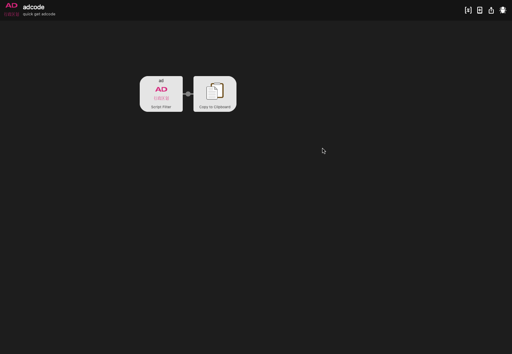
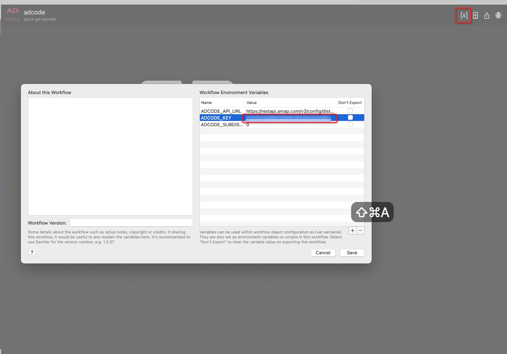

# alfred-adcode 

> 快速查询中国境内，行政区域（依赖 [高德开放平台](https://lbs.amap.com/api/webservice/guide/api/district)）



可以得到：

- 行政区名称
- 区域编码
- 城市编码
- 区域中心点
- 行政区级别
- 行政区边界坐标点

## 安装

_Requires [Node.js](https://nodejs.org) 14+ and the Alfred [Powerpack](https://www.alfredapp.com/powerpack/)._

方式一:

```
$ npm install --global alfred-adcode
```

方式二:

1. [下载最新 workflow](https://github.com/daolou/alfred-adcode/releases/latest)
2. 双击 .alfredworkflow 文件即可进行安装

## 配置

打开配置，如图： 在环境变量 ADCODE_KEY，填入你自己申请的 key（需要预先申请，请看[申请 key](https://lbs.amap.com/dev/key)）

## 使用

1. 使用 `ad` 关键字 触发 workflow
2. 随后输入要查询的区域，可以是地区名（中文），也可以是 6 位数字的区域 code 码,比如 北京 或者 110000
3. 按下 <kbd>Enter</kbd> 或 <kbd>⌘ + c</kbd> 即可复制到粘贴板

## License

MIT © [KhaZix](https://github.com/daolou/alfred-adcode)
